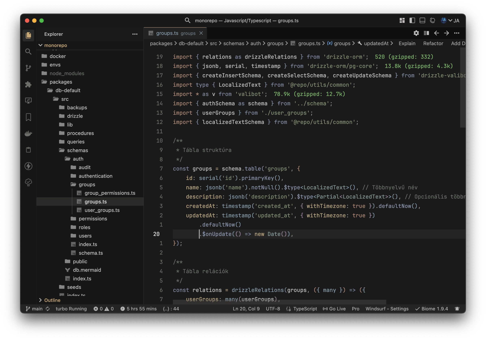

# Általános beállítások (minden profilban közös)

Van néhány beállítás, testreszabás, amit az összes fejlesztési profilban használi szoktam. Ezek az én igényeimhez és ízlésemhez vannak igazítva.

## Kinézet

### Kiegészítők a megjelenéshez
  - Kanagawa Color Theme (`metaphore.kanagawa-vscode-color-theme`)
  - Material Icon Theme (fájl ikonok) (`pkief.material-icon-theme`)
  - Material Product Icons (alkalmazás ikonok) (`pkief.material-product-icons`)
  - Custom Background (egyéni háttér) (`shalldie.background`)

  #### Színbeállítások
  Saját színbeállításokat is készítettem az IDE-hez, amelyet a VSCode settings.json-be lehet beilleszteni. A színkonfiguráció itt található: [`vscode/custom-workbench-color.jsonc`](vscode/custom-workbench-color.jsonc)

## Kiegészítők

- CodeSnap (kódrészlet screenshot) (`adpyke.codesnap`)
- Color Highlight (színek kiemelése kódban) (`naumovs.color-highlight`)
- Gitmoji Commit (emojik commit üzenetekhez) (`seatonjiang.gitmoji-vscode`)
- Docker (Docker támogatás) (`ms-azuretools.vscode-docker`)
- Thunder Client (REST API tesztelés) (`rangav.vscode-thunder-client`)
- Bookmarks (kódbeli könyvjelzők) (`alefragnani.bookmarks`)
- Mermaid Editor (diagram szerkesztő) (`tomoyukim.vscode-mermaid-editor`)
- Snippets Manager (snippetek kezelése) (`zjffun.snippetsmanager`)
- TODO Tree (TODO-k vizuális kezelése) (`gruntfuggly.todo-tree`)
- WakaTime (kódolási statisztika) (`wakatime.vscode-wakatime`)
- WhichKey (billentyűparancs súgó) (`vspacecode.whichkey`)
- Database Client JDBC (`cweijan.dbclient-jdbc`)
- Database Client 2 (adatbázis kliens) (`cweijan.vscode-database-client2`)
---

- **Globális Windsurf/VSCode beállítások:**
  - (Ami mindkét profilban közös)
- **Hasznos billentyűparancsok:**
  - (Saját shortcutok)
